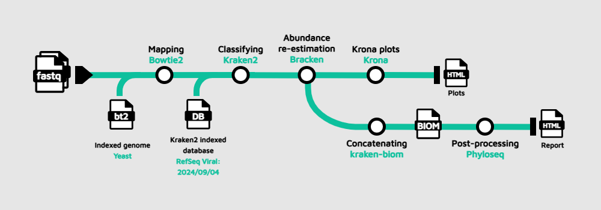

```{r setup, include=FALSE}
knitr::opts_chunk$set(echo = TRUE)
knitr::opts_chunk$set(warning = FALSE, message = FALSE, cache = TRUE)
```

> 📝 **Objective**: Carry out a downstream analysis using the Kraken2/Bracken output to report important insights in terms of differences among samples.

# About the data

<p style='text-align: justify;'>The dataset we will be using for this part of the workshop was collected in Cuatro Ciénegas (México), _an oasis in the Mexican desert whose environmental conditions are often linked to the ones present in ancient seas, due to a higher-than-average content of sulfur and magnesium but a lower concentrations of phosphorus and other nutrients_. For more information about this study, please check [Okie et al.,(2020)](https://elifesciences.org/articles/49816); the BioProject accession number is [PRJEB22811](https://www.ncbi.nlm.nih.gov/bioproject/PRJEB22811).</p>

```{r importingData, echo=TRUE}
library(knitr)
options(conflicts.policy = list(warn = FALSE)) #this line removes all warnings of function masking

#change the PATH according to your settings
tab_sam = read.csv("/Users/yepesgar/Downloads/SIB_IMDAMM/Day1_pm/script/data/test_sheet.csv")
kable(tab_sam)
```

# The pipeline

<p style='text-align: justify;'>For this course, we propose to wrap with Nextflow the protocol published by [Jennifer Lu et al. (2022)](https://www.nature.com/articles/s41596-022-00738-y). The workflow is designed as follows:</p>

{style="display: block; margin: 0 auto"}

<p style='text-align: justify;'>As you can see from the picture, the input is FASTQ files from one or multiple samples, then it performs a host removal with Bowtie2 by aligning the reads against an indexed reference genome to carry out the taxonomic classification with Kraken2 afterwards. Taking the output from Kraken2, a Bayesian species abundance re-estimation is achieved with Bracken, and Krona plots are generated using the Bracken output to visualize interactively the relative abundance of each annotated species. If multiple samples are used as input to the pipeline, the bracken reports will be concatenated and converted into a Biological Observation Matrix (BIOM) file. Finally, the BIOM file will be first converted in a Phyloseq object, and this object will be further processed to generate absolute plots, estimate both α and β-diversity and perform a network analysis; this information will be presented in a final report.html.</p>

<p style='text-align: justify;'>Now, we are going to move to proper directory to run the pipeline, you should be in the directory `nf4-science`. Copy and paste and the following commands:</p>

> Bash
>
> ```
> mv data/metagenomics ./
> cd metagenomics
> ```

We are ready to run the pipeline then, with the command:

> Bash
>
> ```
> nextflow run main.nf --sheet_csv 'data/samplesheet.csv'
> ```

Once it has finished, go back to the working directory

> Bash
>
> ```
> cd .. 
> ```

# Krona Plots

<p style='text-align: justify;'>As mentioned before, this pipeline will provide us with a set of files that are useful for our primary goal related to exploratory data analysis. However, as we do not have enough computational power and storage capacity in GitHub Codespaces, we have executed the pipeline with the real data and databases beforehand. Below you can find the Krona plots depicting the species abundance per sample.</p> 

<p style='text-align: justify;'>**As a reminder, Krona plots are interactive, multi-layered pie charts used to visualize hierarchic data derived from taxonomic annotation of the sequences.**</p>

<select id="kronaSelect">
  <option value="krona1">ERR2143758</option>
  <option value="krona2">ERR2143759</option>
  <option value="krona3">ERR2143760</option>
  <option value="krona4">ERR2143771</option>
  <option value="krona5">ERR2143772</option>
  <option value="krona6">ERR2143774</option>
  <option value="krona7">ERR2143769</option>
  <option value="krona8">ERR2143770</option>
  <option value="krona9">ERR2143773</option>
</select>

<iframe id="krona1" class="kronaFrame" src="krona/ERR2143758.krona.html" width="100%" height="600px"></iframe>
<iframe id="krona2" class="kronaFrame" src="krona/ERR2143759.krona.html" width="100%" height="600px" style="display:none;"></iframe>
<iframe id="krona3" class="kronaFrame" src="krona/ERR2143760.krona.html" width="100%" height="600px" style="display:none;"></iframe>
<iframe id="krona4" class="kronaFrame" src="krona/ERR2143771.krona.html" width="100%" height="600px" style="display:none;"></iframe>
<iframe id="krona5" class="kronaFrame" src="krona/ERR2143772.krona.html" width="100%" height="600px" style="display:none;"></iframe>
<iframe id="krona6" class="kronaFrame" src="krona/ERR2143773.krona.html" width="100%" height="600px" style="display:none;"></iframe>
<iframe id="krona7" class="kronaFrame" src="krona/ERR2143769.krona.html" width="100%" height="600px" style="display:none;"></iframe>
<iframe id="krona8" class="kronaFrame" src="krona/ERR2143770.krona.html" width="100%" height="600px" style="display:none;"></iframe>
<iframe id="krona9" class="kronaFrame" src="krona/ERR2143773.krona.html" width="100%" height="600px" style="display:none;"></iframe>
<script>
document.getElementById("kronaSelect").addEventListener("change", function () {
  const value = this.value;
  document.querySelectorAll(".kronaFrame").forEach(iframe => {
    iframe.style.display = "none";
  });
  document.getElementById(value).style.display = "block";
});
</script>

# Pavian

<p style='text-align: justify;'>Another way to explore the species abundance across samples, and more importantly compare them is to use [Pavian](https://fbreitwieser.shinyapps.io/pavian/). Pavian is an interactive, web-based application designed to analyze, explore, and visualize metagenomic classification results, particularly from tools like Kraken2, Centrifuge, and MetaPhlAn.</p>  

<p style='text-align: justify;'>To use this web server you will need just to upload the Kraken/Bracken reports (`.k2report`) found at `intermediate/kreports/` (Download and extract the folder `intermediate.tar.gz` from the **Moodle page**).</p> 

**In case Pavian web server is not working properly, we have prepared the report for you, you can find it at `intermediate/Pavian`**

# Questions

<p style='text-align: justify;'>Now, perform a visual inspection of the results, and consider the following questions:</p> 

> ❓ **Question**: Do you see anything unusual on it? what would be the reasons causing this problem? what do you propose to solve it?

> ❓ **Question** : What do you think of the percentages considering the type of samples we are analyzing?

> ❓ **Question**: Do you observe any difference among samples/replicates, at what taxonomic level?

## Phyloseq object

<p style='text-align: justify;'>Now, let's create the Phyloseq object using the BIOM file generated by the pipeline and the experiment metadata. We are going to manipulate a bit the object to add the names of the taxonomic ranks, complete the species names and subset it to have only two conditions.</p>

```{r phyloseq, echo=TRUE}
library(phyloseq)
library(ggplot2)
library(tidyr)

data_biom <- import_biom("/Users/yepesgar/Downloads/SIB_IMDAMM/Day1_pm/script/data/merged.biom")
data_biom@tax_table@.Data <- substring(data_biom@tax_table@.Data, 4)
colnames(data_biom@tax_table@.Data)<- c("Kingdom", "Phylum", "Class", "Order", "Family", "Genus", "Species")

tax_table_df <- as.data.frame(tax_table(data_biom))

# Modify the species column to include genus
tax_table_df$Species <- paste(tax_table_df$Genus, tax_table_df$Species, sep = " ")

# Update the taxonomy table in the phyloseq object
tax_table(data_biom) <- as.matrix(tax_table_df)

# Phyloseq object with only Bacteria
data_biom_bact <- subset_taxa(data_biom, Kingdom == "Bacteria")

samples_df <- tab_sam %>% 
  tibble::column_to_rownames("Name") 
samples = sample_data(samples_df)
otu_inf = data_biom_bact@otu_table
phy_inf = data_biom_bact@tax_table
merged <- phyloseq(otu_inf,phy_inf,samples)

two_sample_data <- subset_samples(merged, Group == "Cont" | Group == "Unenriched")
two_sample_data
```

We already have created our Phyloseq object, and we are ready to move on with the analysis.

# α-Diversity

Next, Let's explore the α-diversity among samples using two indexes, Chao1 and Shannon:

```{r alpha_plot, echo=TRUE}
p = plot_richness(two_sample_data, measures=c("Chao1", "Shannon"), color = "Group")+
    theme_bw()+
    theme(axis.text.x = element_text(angle = 45, vjust = 1, 
                                   size = 12, hjust = 1),
        axis.text.y = element_text(size = 14),
        axis.title = element_text(size = 14),
        panel.grid.major = element_blank(), 
        panel.grid.minor = element_blank(),
        panel.border = element_blank(),
        strip.text.x = element_text(size = 14),
        legend.text = element_text(size = 10),
        legend.title = element_text(size = 14),
        axis.line = element_line(colour = "black"),
        )+
  labs(x = "Samples",
       color = "Group")
  
p + geom_point(size=5, alpha=0.7)
```

# β-Diversity

<p style='text-align: justify;'>_β-Diversity measures how different two or more communities are, either in their composition (richness) or in the abundance of the organisms that compose it (abundance)_. To perform the analysis, we need to use dimensionality reduction techniques which enable comparisons in a space closer to our understanding (up to 3 dimensions). First, let's create a heatmap that includes an ordination-based ordering of samples or taxa with a Bray-Curtis dissimilarity matrix as input for the ordination method (PCoA):</p>

## Heatmap

> ⚠ **WARN**: For visualization purposes, we filter the OTU table using a pre-specified criterion, and we are using _agglomerated_ data.

```{r heatmap, echo=TRUE}
library(phyloseq)
library(ggplot2)
library(tidyr)

phylum_data = tax_glom(two_sample_data, "Phylum")
threshold <- 500
phylum_data_filt <- filter_taxa(phylum_data, function(x) sum(x) > threshold, prune = TRUE)

phyloseq::plot_heatmap(phylum_data_filt, method = "PCoA", distance = "bray",
             taxa.label = "Phylum",
             trans=NULL, low="beige", high="red", na.value="beige")+    theme_bw()+
    theme(axis.text.x = element_text(angle = 45, vjust = 1, 
                                   size = 12, hjust = 1),
        axis.text.y = element_text(size = 14),
        axis.title = element_text(size = 14),
        panel.grid.major = element_blank(), 
        panel.grid.minor = element_blank(),
        strip.text.x = element_text(size = 14),
        legend.text = element_text(size = 10),
        legend.title = element_text(size = 14))
```

## Ordination plots

### Principal Coordinate Analysis (PCoA)

<p style='text-align: justify;'>Ordination plots are obtained after the application of a method aiming to reduce the dimensionality of the data. As before, we are using a Bray-Curtis dissimilarity matrix as input for a PCoA to establish data structures that guide us towards the identification of differences among samples.</p>

```{r pcoa_plot_samples, echo=TRUE}
data.ord <- ordinate(two_sample_data, "PCoA", "bray")
plot_ordination(two_sample_data, data.ord, type="samples", color="Group",
                title="Principal Coordinate Analysis")+
    theme(axis.text = element_text(size = 14), axis.title = element_text(size = 14),
        legend.text = element_text(size = 14), strip.text.x = element_text(size = 14),
        plot.title = element_text(size = 16),
        legend.title = element_text(size=16),
        panel.border = element_blank(),
        panel.grid.major = element_blank(),
        panel.grid.minor = element_blank(),
        axis.line = element_line(colour = "black"),
        panel.background = element_blank())+
  geom_point(size=5, alpha=0.7)
```

# Network Analysis

<p style='text-align: justify;'>Now, leveraging the Phyloseq object and its native functionalities, we can perform a simple network analysis (using Bray-Curtis matrix as input):</p>

```{r network, echo=TRUE}
set.seed(42)
plot_net(phylum_data, distance = "bray", type = "taxa",
         maxdist = 0.9, color="Phylum")+
  guides(color = guide_legend(ncol = 3))
```

# Exercises

Now it's your turn to carry on with the analysis. For instance, you can subset the Phyloseq object to compare the fertilized ponds against the control, then: 

> ❓ **α-Diversity**: Do you observe any difference between samples terms of α-diversity? Try other indexes.

Below, there is a hint:

```{r hint_1, echo=TRUE}
measures <- c("Observed", "Chao1", "ACE", "Shannon", "Simpson", "InvSimpson", "Fisher")

```
> ❓ **β-Diversity**: Are the samples organized in an expected organization along the gradients (coordinates)? Does the PCoA capture well the variability of the data? Try different ordination methods to compare the results. 

Below, there is a hint:

```{r hint_2, echo=TRUE}
dist_methods <- unlist(distanceMethodList)
```

> ❓ **Normalization/transformation methods**: As you may have noticed, we did not apply any normalization/transformation method to the data. Let's try a centered-log ratio transformation.  

For the centered-log ratio transformation, this is how it is achieved:

```{r hint_4, echo=TRUE}
BiocManager::install("microbiome")
library(microbiome)
data_biom_clr <- microbiome::transform(phylum_data_filt, "clr")
```

Now, re-create the heatmap and the PCoA plots with the transformed data and using Euclidean as distance method. Evaluate if there are differences.

**Optional**

> ❓ **Different taxonomic ranks**: We have performed the analysis at **phylum** level, try changing the taxonomic rank and try to track if the differentially abundant taxa belong to the same phyla identified with the preliminary analysis. Be prepared for really messy plots!

**Bonus**

> ❓ **Empty fields**: Thr the following codeline and observe the results. There are species that do not account with genus, order or taxa level information. How is this possible? How do you propose to handle this? What are the implications of this situation?

```{r empty_fields, echo=TRUE}
summary(data_biom@tax_table@.Data== "")
```

# Additional resources

<p style='text-align: justify;'>If you want to explore more in detail how you can expand your analysis, please check the following resources:</p>

* [Phyloseq tutorial](https://vaulot.github.io/tutorials/Phyloseq_tutorial.html)
* [Data Processing and Visualization for Metagenomics](https://carpentries-lab.github.io/metagenomics-analysis/)
* [Integrated analysis with microViz](https://david-barnett.github.io/microViz/)
* [ANCOM-BC2 tutorial](https://www.bioconductor.org/packages/release/bioc/vignettes/ANCOMBC/inst/doc/ANCOMBC2.html)