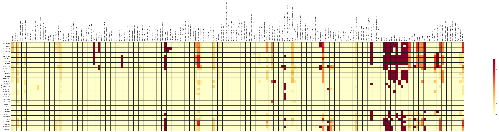
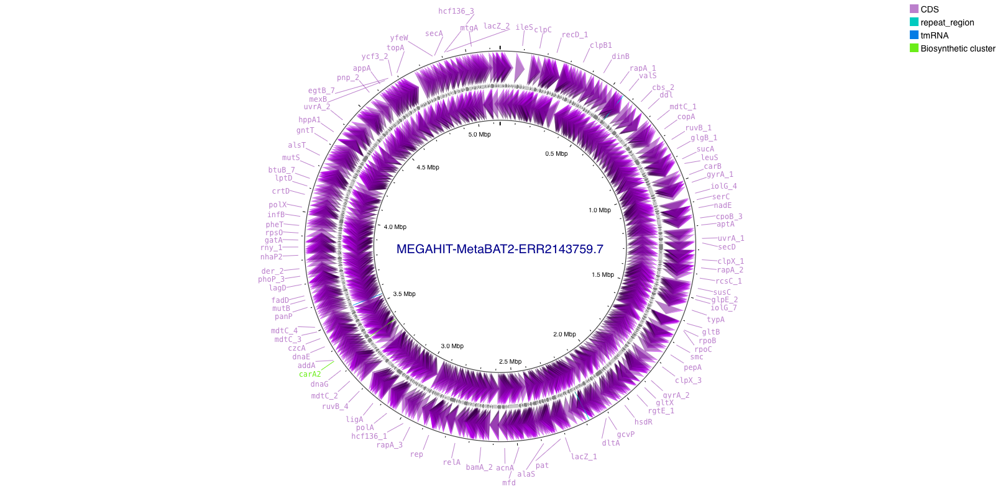

```{r setup, include=FALSE}
knitr::opts_chunk$set(echo = TRUE)
knitr::opts_chunk$set(warning = FALSE, message = FALSE, cache = TRUE)
```

> 📝 **Objective**: Perform the analysis of Metagenome-Assembled Genomes (MAGs) recovered from a public dataset using an end-to-end pipeline.

# nf-core/mag

<p style='text-align: justify;'>The pipeline used to build the MAGs was nf-core/mag, which integrates several tools to assemble the sequences and polish the recovered MAGs. The usage of the pipeline can be checked [here](https://nf-co.re/mag/2.5.1/), and below is the workflow it follows:</p>

<center>{ style="display: block; margin: 0 auto"}</center>

<p style='text-align: justify;'>Since many of the downstream processes demand high computational resources, we have pre-computed some of them for you. However, we will explain step-by-step what we did or we are going to provide with the references to review what's happening under the hood.</p>

# MAGFlow/BIgMAG

<p style='text-align: justify;'>[MAGFlow](https://f1000research.com/articles/13-640) is a tool designed to combine several tools to measure the quality of the bins/MAGs, as well as to taxonomically annotate them. This is the workflow:</p>

<center>{ style="display: block; margin: 0 auto"}</center>

<p style='text-align: justify;'>The output of this tool is a ready-to-use file that concatenates the results, and it can then used as input for [BIgMAG](https://f1000research.com/articles/13-640). We will not execute MAGFlow today, and hence you will find the `final_df.tsv` to display the BIgMAG dashboard. Let's create then the environment for BIgMAG by running the following commands on the GitHub Codespace terminal:</p>

> Bash
>
> ```
> git clone https://github.com/jeffe107/BIgMAG
> conda create -n BIgMAG --file BIgMAG/requirements.txt
> conda activate BIgMAG
> ```

> ⚠ **WARN**: Whenever you are asked whether to install extra packages, please say yes to all! 

<p style='text-align: justify;'>Now, we are ready to execute BIgMAG to perform the exploratory analysis of the MAG overall quality and annotation:</p>

> Bash
>
> ```
>  BIgMAG/app.py -p 8050 data/magflow/final_df.tsv
> ```

<p style='text-align: justify;'>You will see on the terminal a link to the dashboard or the editor will offer you an option to directly open a new tab on the browser, just click on it.</p>

<p style='text-align: justify;'>Now, it is your turn to analyze the results, use these questions to guide your thoughts:</p>

> ❓ **Question**: Overall, the MAGs recovered within your assigned samples have good quality? What would you suggest to improve the quality of the bins that do not depict enough quality?

> ❓ **Question**: The results displayed by BUSCO and CheckM2 are correspondant? Why do you think this is happening? 

> ❓ **Question**: What about the taxonomical classification, what would you report in terms of comparison among samples? 

> ❓ **Question**: Were the samples clustered as you expected? What caused this behavior?

> ❓ **Question**: Is there any unsual sample or MAG that catches your attention? What further analysis you would propose to follow in order to dig into this special sample or MAG?

> ⚠ **WARN**: Do not forget to stop the dashboard with Ctrl + c, and to deactivate the environment with:
> ```
>  conda deactivate
> ```

# KEGG Decoder

<p style='text-align: justify;'>Moving forward, it is time now to identify genomic features within the bins/MAGs, [KEGG Decoder](https://github.com/bjtully/BioData/tree/master/KEGGDecoder) is a tool that interprets the metabolic potential of the MAGs (or any genome in general) by analyzing the presence of KEGG Orthology (KO) identifiers. It maps these KOs to major metabolic pathways and summarizes the completeness of each pathway based on predefined modules. Being so, we can infer the metabolic capabilities of the community, and gain insights into functional differences across samples or MAGs.</p>

<p style='text-align: justify;'>[Prokka](https://github.com/tseemann/prokka) (included within nf-core/mag) has provided us with the annotation about the presence/localization of enzymes in the bins/MAGs that are involved in a wide variety of processes. Nonetheless, Prokka uses EC numbers to describe such genomic features, and as a result, we needed to transform these annotations to K numbers  and merge them into a single file (this was already done for you). Now, let's install KEGG decoder:  

> Bash
>
> ```
> conda create -n keggdecoder python=3.6
> conda activate keggdecoder
> python3 -m pip install KEGGDecoder
> ```

> ⚠ **WARN**: Whenever you are asked whether to install extra packages, please say yes to all!

<p style='text-align: justify;'>Now, we are ready to execute this software to determine the presence and completeness of the annotated metabolic pathways:</p>

> Bash
>
> ```
> KEGG-decoder --input data/k_numbers/megahit_k_numbers.tsv --output kegg_output.tsv --vizoption static
> ```

<p style='text-align: justify;'>This command will create a heatmap where you can perform a comparison across MAGs. In this case, we are analyzing the MAGs obtained with the assembler MEGAHIT. It should look like this:</p>

<center>{ style="display: block; margin: 0 auto"}</center>

<p style='text-align: justify;'>On the y axis you will see just random letters per row, these are the corresponding names Prokka has asigned to the genomic features in the MAG. Below you can find a mapping file between the name of the bin/MAG and the contig name:</p>

```{r table_contigs, echo=FALSE}
library(knitr)
library(dplyr)
library(kableExtra)

contigs_df <- read.table("/Users/yepesgar/Downloads/SIB_IMDAMM/Day2/script/data/summary_contigs.tsv", header = TRUE, sep = "\t")

contigs_df %>% 
  kable %>%
  kable_styling(bootstrap_options = c("striped", "hover")) %>% 
  scroll_box(width = "800px", height = "400px")
```

> ⚠ **WARN**: Do not forget to deactivate the environment with:
> ```
>  conda deactivate
> ```

# COG Annotation

<p style='text-align: justify;'>Clusters of Orthologous Genes (COGs) are groups of genes from different organisms that evolved from a common ancestral gene and retain the same function. To explore these genes, we rely on the amino-acid sequences of the coding regions provided by Prokka (_.faa_ files). The next task then will be to install a [COGclassifier](https://github.com/moshi4/COGclassifier) in order to detect Cluster of Ortholog Genes:</p>

> Bash
>
> ```
> conda create -n cogclassifier -c conda-forge -c bioconda cogclassifier
> conda activate cogclassifier
> ```

> ⚠ **WARN**: Whenever you are asked whether to install extra packages, please say yes to all!

<p style='text-align: justify;'>This tool _automatically perform the processes from searching query sequences into the COG database, to annotation and classification of gene functions, to generation of publication-ready figures_. However, the input for this tool is only one genome each time. This does not mean that we can not analyze all the bins/MAGs, we could simply execute the software for each of them and integrate the data afterwards. To launch the tool just run on the terminal:</p>

> Bash
>
> ```
> COGclassifier -i data/faas/MEGAHIT-MetaBAT2-ERR2143759.7.faa -o cog_annotation --download_dir ./cog_database
> ```

<p style='text-align: justify;'>Once it has finished, inside `cog_annotation` you will see the output represented as tables featuring counts, summary and annotations, as well as interesting figures showcasing the proportion of the different COG categories, just like this:</p>

<center>{ style="display: block; margin: 0 auto"}</center>

> ❓ **Question**: What are the categories that are more repsresentative of this MAG? Do you see any odd results?

> ❓ **Question**: If you decide to analyze all of the MAGs, do you think it would be a fair comparison just using the raw counts obtained by the software? If not, what strategy would you propose to proceed further?

> ⚠ **WARN**: Do not forget to deactivate the environment with:
> ```
>  conda deactivate
> ```

# dbCAN3

<p style='text-align: justify;'>CAZymes (Carbohydrate-Active enZymes) are enzymes involved in the breakdown, biosynthesis, or modification of carbohydrates and glycoconjugates. They play a crucial role in processing complex carbohydrates such as cellulose, hemicellulose, starch, and chitin, among others. To detect the presence of this kind of enzymes, we are going to use the tool [dbCAN3](https://bcb.unl.edu/dbCAN2/blast.php), which is an automated web server designed to run the software and provide the results.</p>

<p style='text-align: justify;'>To execute the tool, you just need to download the file from **Codespaces** `data/faas/MEGAHIT-MetaBAT2-ERR2143759.7.faa`, upload it to the server (click [here](https://bcb.unl.edu/dbCAN2/blast.php)), submit the job and wait for the results.</p>

It should look like this:

```{r db_can, echo=FALSE}
dbcan_df <- read.csv("/Users/yepesgar/Downloads/SIB_IMDAMM/Day2/script/data/dbcan_output.csv")
dbcan_df %>% 
  kable %>%
  kable_styling(bootstrap_options = c("striped", "hover")) %>% 
  scroll_box(width = "800px", height = "400px")
```


<p style='text-align: justify;'>Visit the [CAZy](https://www.cazy.org/) website if you want to know more about enzyme families and classes reported by dbCAN3. Similar to the COGclassifier, we can perform the analysis for all the MAGs, and integrate the data afterwards to achieve an overall comparison.</p>

# antisMASH

<p style='text-align: justify;'>[antiSMASH](https://antismash.secondarymetabolites.org) (antibiotics & Secondary Metabolite Analysis SHell) is a tool that detects and analyzes biosynthetic gene clusters (BGCs) in microbial genomes. These clusters are groups of co-located genes that together encode the machinery to produce secondary metabolites—specialized compounds that are not essential for basic cellular functions.</p>

<p style='text-align: justify;'>Analogous to dbCAN3, we will use the webserver to annotate one of the MAGs recovered by the pipeline. Upload the file (Download and extract the folder `intermediate.tar.gz` from the **Moodle page**) `intermediate/gbks/MEGAHIT-MetaBAT2-ERR2143759.7.gbk` to  [antiSMASH](https://antismash.secondarymetabolites.org) and wait for the results.</p>

<p style='text-align: justify;'>If it is kind of slow, we have performed this step for you and we stored the results within the same `intermediate.tar.gz` file, at `intermediate/antiSMASH/index.html`</p>

# Proksee

<p style='text-align: justify;'>[Proksee](https://proksee.ca/) is an interactive web-based tool for visualizing, annotating, and analyzing prokaryotic genomes. Using this tool we can visualize genomes as circular or linear maps, annotate them, customize the visualization and export high-level and detailed-oriented figures.</p>

<p style='text-align: justify;'>Same as with previous applications, you just need to upload the annotated genome in FASTA or GenBank format. Here, we are going to leverage the files produced by Prokka, and hence you just need to upload the file (Download and extract the folder `intermediate.tar.gz` from the **Moodle page**) `intermediate/gbks/MEGAHIT-MetaBAT2-ERR2143759.7.gbk` to [Proksee](https://proksee.ca/).</p>

You can customize the display, add features, re-annotate the genome among many other functionalities. Unfortunately, it processes only one genome per time. From here it's up to your creativity to take advantage from this tool.

You should be seeing this example:

<center>{ style="display: block; margin: 0 auto"}</center>

# Pangenome

<p style='text-align: justify;'>For the past tools we have not analyzed just a random MAG, we selected this one given that it's taxonomic annotation is shared across different samples (from BIgMAG exercise), and therefore it is interesting to establish the similarities/differences among these MAGs to enable a pangenome analyis. In this case, we study the entire gene repertoire of related MAGs (same species or genus); for our analysis we have selected some MAGs based on GTDB classification.</p>

<p style='text-align: justify;'>Next, we run the tool [Roary](https://sanger-pathogens.github.io/Roary/) that determines the core genome, accessory genome and unique genome. We have pre-computed the results for you following the tutorial presented by the developers of the tools, and now we are going to visualize the results using [Phandango](https://jameshadfield.github.io/phandango/). 

Drag and drop the files (Download and extract the folder `intermediate.tar.gz` from the **Moodle page**) `intermediate/pangenome/JAAUTG01/workshop.newick` and `intermediate/pangenome/JAAUTG01/gene_presence_absence.csv` to the [Phandango web server](https://jameshadfield.github.io/phandango/) and visualize the results.</p>

It should look like this:

<center>{ style="display: block; margin: 0 auto"}</center>

<p style='text-align: justify;'>Usually, this analysis is carried out using a reference genome; however, given that these MAGs are not annotated at species level, and genus annotation is not informative, we do not count with a reference genome to explore the pangenome of these MAGs. You can visualize an example that includes reference genome with the files found at `intermediate/pangenome/example_with_reference`.</p>