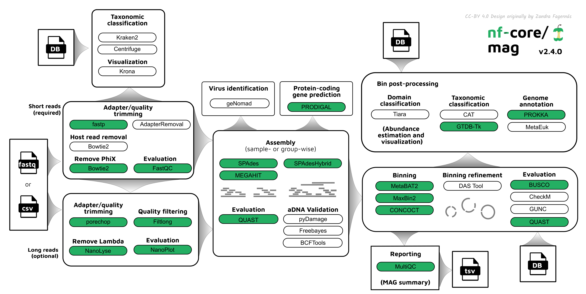
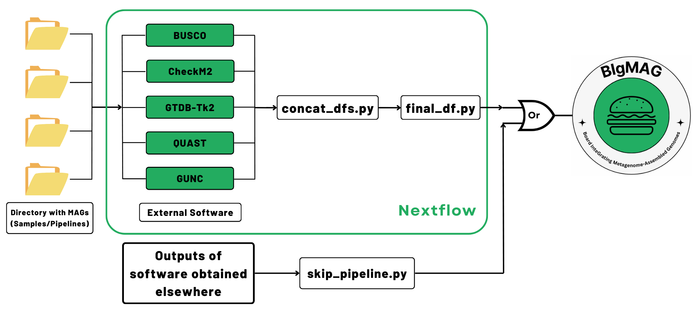

```{r setup, include=FALSE}
knitr::opts_chunk$set(warning = FALSE, message = FALSE, cache = FALSE, echo = FALSE)
```

# Running nf-core/mag

<center>{ style="display: block; margin: 0 auto"}</center>

<p style='text-align: justify;'>In order to reconstruct the MAGs, we pre-executed the pipeline [nf-core/mag](https://nf-co.re/mag/3.4.0) that requires Nextflow pre-installation. Please make sure that you have Nextflow (and Java 17 or 19) before running the pipeline by following the tutorial [here](https://www.nextflow.io/docs/latest/install.html).</p>

The command to run nf-core/mag was:

> Bash
>
> ```
> nextflow run nf-core/mag -r 3.0.2 \
> -profile apptainer --input run_workshop.csv \
> --outdir output --skip_gtdbtk --skip_binqc \
> --skip_concoct --refine_bins_dastool
> ```

> ⚠ **WARN**: Important considerations.

<p style='text-align: justify;'>* We used apptainer as profile given that this the container technology installed in our system. This is specific to each system and/or user.</p>

<p style='text-align: justify;'>* By default, nf-core/mag will try to download GTDB which requires at least 80 GB of storage, you can skip it with the parameter `--skip_gtdbtk`.</p>

<p style='text-align: justify;'>* We skipped binning with CONCOT (`--skip_concoct`) given that it tends to fail constantly. Also, we skipped bin quality control (`--skip_binqc`) since we planned to run MAGFlow afterwards, and it would be somehow the same process.</p>

<p style='text-align: justify;'>* We enabled bin refinement with DASTool (`--refine_bins_dastool`) as this considerably enhances the final versions of the bins.</p>

<p style='text-align: justify;'>* Please notice that each time you run the pipeline you need to specify the version. This is useful for reproducibility.</p>

* Finally, the input data was organized in the following manner in a _.csv_ file:

```{r table_samples, echo=FALSE}
library(knitr)
library(dplyr)
library(kableExtra)

df <- read.csv("/Users/yepesgar/Downloads/SIB_IMDAMM/commands/data/run_workshop.csv", header = FALSE)

df %>% 
  kable %>%
  kable_styling(bootstrap_options = c("striped", "hover")) %>% 
  scroll_box(width = "900px", height = "400px")
```

<p style='text-align: justify;'>For more information about parameters and how to run the pipeline, please check the nf-core [website](https://nf-co.re/mag/3.4.0/parameters/).</p>

# Running MAGFlow

<center>{ style="display: block; margin: 0 auto"}</center>

<p style='text-align: justify;'>After obtaining the bins from nf-core/mag, we installed and executed MAGFlow following the documentation available at the [repository](https://github.com/jeffe107/MAGFlow). The command launched once installed was:</p>

> Bash
>
> ```
> nextflow run MAGFlow/main.nf \
-profile apptainer \
--csv_file '/data/projects/p774_MARSD/MAGFlow/workshop.csv' \
--outdir '/data/projects/p774_MARSD/MAGFlow/workshop' \
--run_gtdbtk2 \
--directory_to_bind '/data/projects/p774_MARSD' \
> ```

> ⚠ **WARN**: Important considerations.

<p style='text-align: justify;'>* Again, we used apptainer given that is the technology available in our system, the parameter `--directory_to_bind` is related to this aspect as well.</p>

* <p style='text-align: justify;'>In this case, we performed the analysis including GTDB-Tk2, which means that the pipeline downloaded the dabatase automatically, please make sure you have enough space or remove the parameter `--run_gtdbtk2`.</p>

* Finally, the input data was organized in the following manner in a _.csv_ file:

```{r magflow_samples, echo=FALSE}
library(knitr)
library(dplyr)
library(kableExtra)

df2 <- read.csv("/Users/yepesgar/Downloads/SIB_IMDAMM/commands/data/workshop.csv", header = FALSE)

df2 %>% 
  kable %>%
  kable_styling(bootstrap_options = c("striped", "hover")) %>% 
  scroll_box(width = "900px", height = "300px")
```
